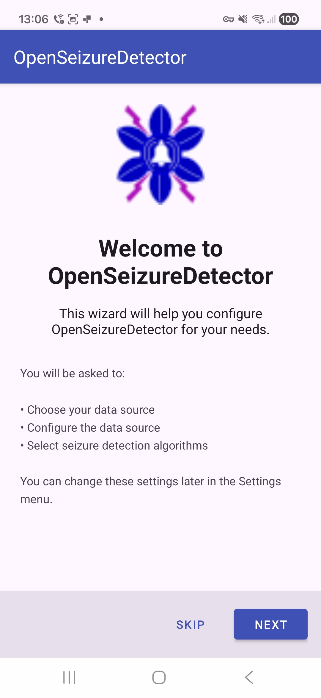
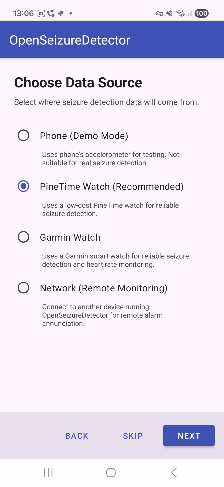
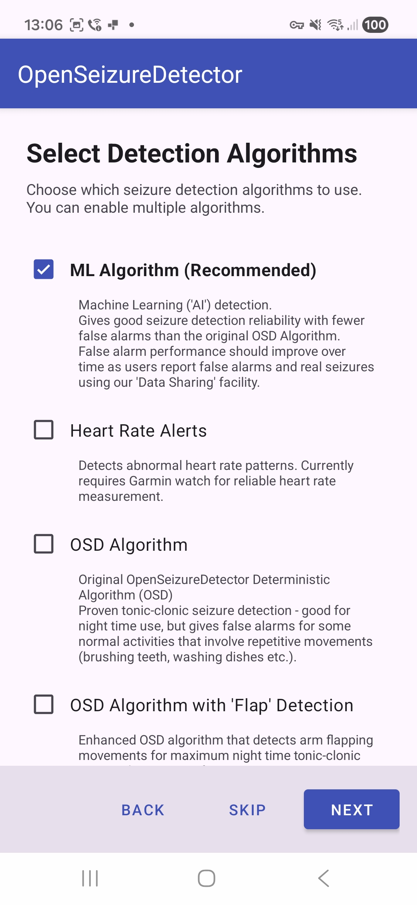
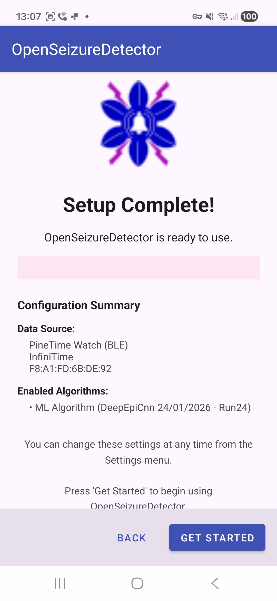
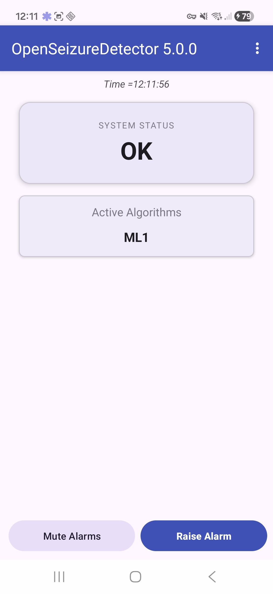
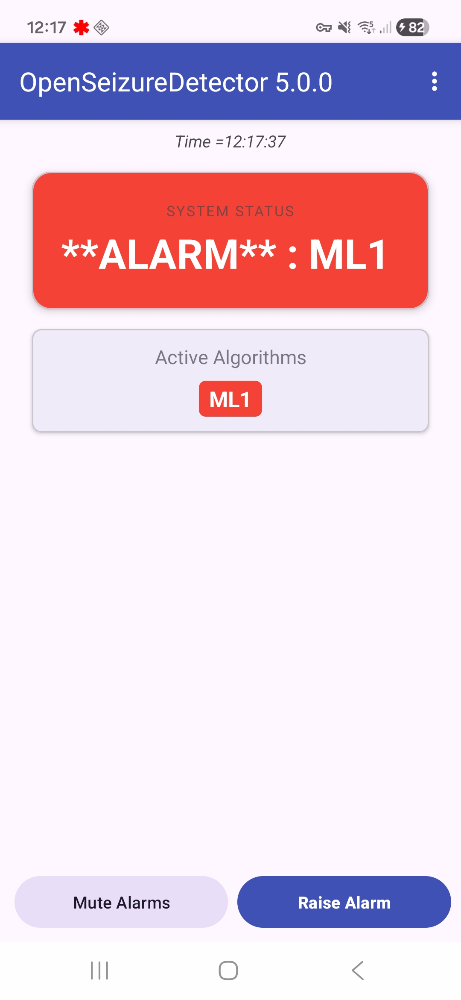
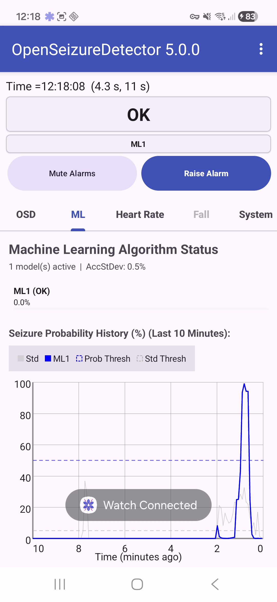
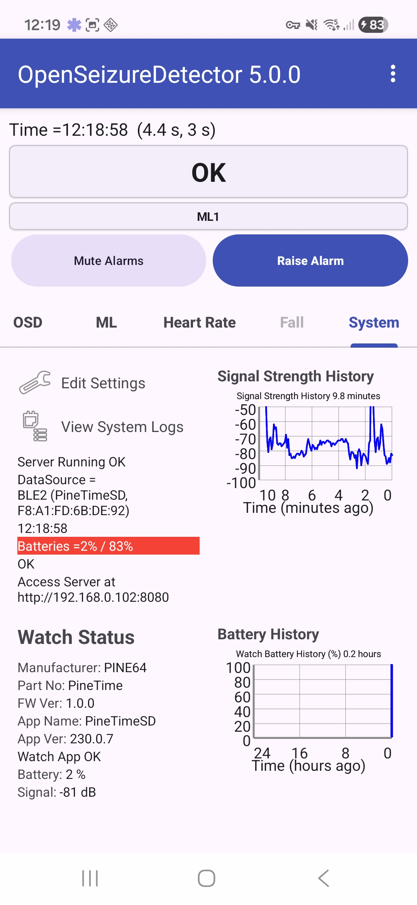

OpenSeizureDetector - Android App
=================================

Open Seizure Detector is a set of software tools intended to support people caring for someone with epilepsy.
It is intended to monitor movement (and optionally heart rate) and generate alarms if seizure-like movement or
abnormal heart rate is detected.

It uses a [PineTime](https://pine64.org/devices/pinetime/) or Garmin watch to collect movement (acceleration) data and transfer the data to an Android phone.
The phone processes the data using either deterministic or machine learning ("AI") algorithms to identify seizure-like activity

This repository contains the source code for the main 
[OpenSeizureDetector](https://www.openseizuredetector.org.uk/) 
Android App, which is published on 
[Google Play Store](https://play.google.com/store/apps/details?id=uk.org.openseizuredetector).

For a detailed architectural overview (activities, service, data flow, resources) see [APP_STRUCTURE.md](doc/APP_STRUCTURE.md).

See the [OpenSeizureDetector Web Site](https://www.openseizuredetector.org.uk/) for more details.


## First-Run Setup 'Wizard'
   

## Simple Basic Mode User Interface
 

## Detailed Advanced Mode User Interface
 


Principle of Operation
======================
It is based on an accelerometer monitoring movement, or detection of abnormal heart rate.  

The movement analysis can use either a deterministic altorithm based on Fourier analysis to extract the 
frequency spectrum of the movement, and detect excessive movement in a given frequency band, or a Machine Learning
model utilising neural networks.

Development
===========
Git Branches
------------
  - The version which is currently published on Play Store is the 'master' branch.
  - The development version which will be the next major release is the Beta branch - this is released on play store for beta testers.
  - The current working development version is the Alpha branch - this is released on play store for alpha testers.

So new developers wishing to implement features should create a fork of the Alpha or Beta branch and create a pull request agains that.

Compilation
-----------
  - Install the latest version of Android Studio
  - Clone this repository and checkout the beta or alpha branch
  - In android studio, open the folder containing the cloned repository
  - Android Studio will take quite a long time downloading dependencies ('Gradle Sync')
  - Select the Build->Make Project menu option - the code should compile, leading to a 'Build Successful' message.
   
Installation
------------
  - You should be able to plug your phone into the computer running Android Studio and Android Studio will allow you to run the app on the phone (the drop down menu below the main menu bar lists available devices)
  - If the phone does not appear, there are a few possibilities:
      - Check the phone has Developer Mode enabled (there should be a Developer menu in the phone settings)
      - Check that USB deugging is enabled in the developer menu on the phone.
      - There may be a phone notification asking if you want to grant the computer access to the phone - select yes - if this has disappeared, try disconnecting then re-connecting the phone.
      - On Linux you need to set a UDEV rule, and the user must be a member of the plugdev group (log out and back in again after changing the group membership to make sure it takes effect)  (best check the Google documentation for how to do this rather than believe somethign I have written).
- The .apk file that is generated by 'make project' can be transferred to the phone, then the phone file browser should allow it to be installed (with warnings about installing apps from untrusted sources).
    - If you have the official release from Play Store installed, it will refuse to install a development build - you have to uninstall the official version first.
 
The setup 'wizard' that is provided in Version 5.x will guide the user through setting up the PineTime watch and
selecting which algorithms to use.
If using a Garmin watch, the Garmin watch app needs to be installed separately using a computer - see the [web site](https://www.openseizuredetector.org.uk/?page_id=1128) for details.  

Code Structure
--------------
See the [APP_STRUCTURE.md](doc/APP_STRUCTURE.md) file in the doc folder for a detailed overview of the code structure.)

## Testing

This project includes unit tests and Android instrumentation tests for `MlModelManager` covering network failures, invalid JSON, download cancellation, invalid filenames, and model loading (downloaded vs bundled fallback).

- Unit tests location: `app/src/test/java/uk/org/openseizuredetector/MlModelManagerTest.java`
- Instrumentation tests location: `app/src/androidTest/java/uk/org/openseizuredetector/MlModelManagerInstrumentedTest.java`

*It would be very good to add instrumentation tests for other aspects of the app to help with testing future updates.*

### Prerequisites

- Ensure Gradle sync completes so test dependencies are resolved.
- Tests rely on:
  - JUnit 4
  - Robolectric (unit tests)
  - OkHttp MockWebServer (unit and instrumentation tests)
  - AndroidX Test and Espresso (instrumentation tests)

### Running unit tests

```bash
./gradlew test
```

The unit tests validate:
- Index fetch network failure returns `null` to the callback
- Invalid JSON in index returns `null`
- Download cancellation reports failure and cleans partial files
- Fallback to bundled model when no downloaded model exists
- Use downloaded model when present
- 404 invalid filename download failure

### Running instrumentation tests

Start an emulator or connect a device, then run:

```bash
./gradlew connectedAndroidTest
```

Instrumentation tests validate on-device behavior:
- Bundled model fallback loads successfully when no downloaded model is present
- Downloaded model from app storage loads successfully
- Invalid filename (404) results in a failed download callback

### Troubleshooting

- If the IDE shows unresolved symbols like `RobolectricTestRunner` or `MockWebServer`, ensure Gradle sync is completed and `mavenCentral()` is present in repositories.
- If `testBundledFallbackLoadsOnDevice` fails due to missing bundled asset:
  - Confirm the bundled model file (`cnn_v0.24.tflite`) is packaged and accessible via `org.tensorflow.lite.support.common.FileUtil.loadMappedFile(context, filename)`.
  - If needed, adjust packaging location (e.g., `src/main/assets`) and loading method.
- For flaky network-dependent tests, MockWebServer enqueues deterministic responses; re-run if the emulator/device is under high load.

### Updating tests

`MlModelManager` provides a test-friendly constructor to inject a base URL and index filename:

```java
// For tests with MockWebServer
MlModelManager mm = new MlModelManager(context, baseUrl, "index.json");
```

This allows unit and instrumentation tests to point at a local server for predictable behavior.

Licence
=======
My code is licenced under the GNU Public Licence - for associated libraries 
please see [CREDITS.md](CREDITS.md) for details of contributors and open source libraries used.

Credits
=======
see [CREDITS.md](CREDITS.md) for details of contributors and open source libraries used.


Graham Jones, May 2026.  (graham@openseizuredetector.org.uk)
