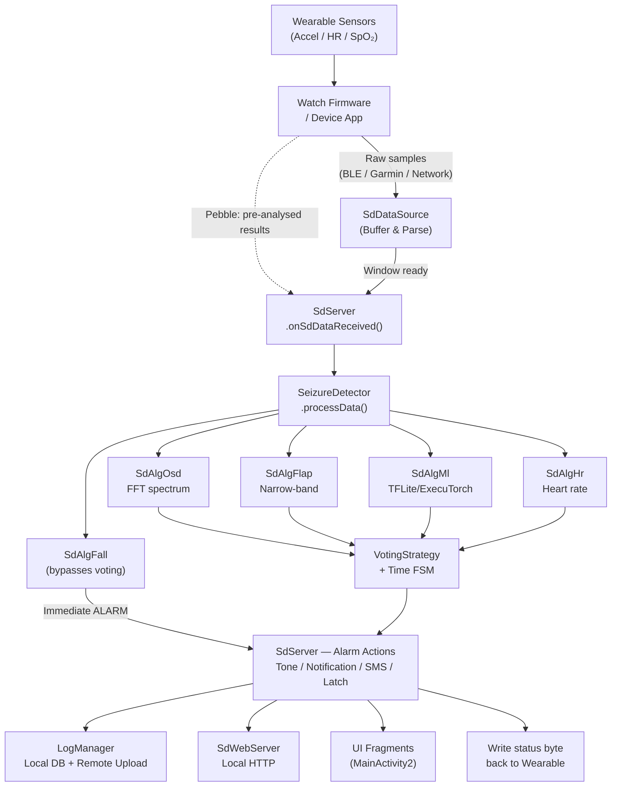

# OpenSeizureDetector Android App — Structure Reference

> **Version 5.x** · Last updated May 2026  
> This document is the authoritative architectural reference for contributors. It describes the package layout, component responsibilities, data flow, and the detection algorithm pipeline as they exist in the current codebase.

---

## Table of Contents

1. [High-Level Architecture](#1-high-level-architecture)
2. [Package Layout](#2-package-layout)
3. [Application Startup & Lifecycle](#3-application-startup--lifecycle)
4. [Foreground Service — SdServer](#4-foreground-service--sdserver)
5. [Data Sources](#5-data-sources)
6. [Detection Algorithm Pipeline](#6-detection-algorithm-pipeline)
7. [UI — Activities & Fragments](#7-ui--activities--fragments)
8. [Data Layer](#8-data-layer)
9. [Logging & Data Sharing](#9-logging--data-sharing)
10. [Utilities](#10-utilities)
11. [Embedded Web Server](#11-embedded-web-server)
12. [Preferences System](#12-preferences-system)
13. [Resource Folder Structure](#13-resource-folder-structure)
14. [Permissions](#14-permissions)
15. [Alarm State Reference](#15-alarm-state-reference)
16. [End-to-End Data Flow](#16-end-to-end-data-flow)
17. [Adding a New Data Source](#17-adding-a-new-data-source)
18. [Adding a New Algorithm](#18-adding-a-new-algorithm)
19. [Key Entry Points for Debugging](#19-key-entry-points-for-debugging)
20. [Related Documents](#20-related-documents)

---

## 1. High-Level Architecture

OpenSeizureDetector is a **foreground-service Android application** that continuously collects motion (accelerometer) and physiological (heart rate, SpO₂) data from a paired wearable device or the phone's own sensors. It analyses the data in real time to detect tonic–clonic seizures and other health events, raising local audible alarms and optionally sending SMS/phone-call alerts.

```
┌─────────────────────────────────────────────────────────────────────┐
│  Android Phone                                                      │
│                                                                     │
│  ┌─────────────┐     ┌──────────────────────────────────────────┐  │
│  │  UI Layer   │◄────│           SdServer (Foreground Service)  │  │
│  │ (Activities │     │                                          │  │
│  │  Fragments) │     │  ┌────────────┐   ┌──────────────────┐  │  │
│  └─────────────┘     │  │ SdDataSource│──►│ SeizureDetector  │  │  │
│                      │  │ (one of N  │   │ (algorithm hub)  │  │  │
│  ┌─────────────┐     │  │  sources)  │   └──────────────────┘  │  │
│  │ SdWebServer │◄────│  └────────────┘                         │  │
│  │ (local HTTP)│     │  ┌────────────┐   ┌──────────────────┐  │  │
│  └─────────────┘     │  │ LogManager │   │  Alarm / Notify  │  │  │
│                      │  └────────────┘   └──────────────────┘  │  │
│  ┌─────────────┐     └──────────────────────────────────────────┘  │
│  │Remote APIs  │                                                    │
│  │(Firebase /  │                                                    │
│  │ OSD API)    │                                                    │
│  └─────────────┘                                                    │
└─────────────────────────────────────────────────────────────────────┘
         ▲                         ▲
         │ BLE / Garmin Connect    │ SMS / Phone Call
    Wearable Device             Mobile Network
```

**Core design principles:**
- `SdServer` is the runtime heart. Activities bind to it for display only; they never own detection state.
- `SdDataSource` subclasses handle **data acquisition only**. All analysis is delegated to `SeizureDetector`.
- `SeizureDetector` is a pluggable coordinator: it instantiates only the active algorithm objects and combines their results via a configurable `VotingStrategy`.

---

## 2. Package Layout

All application code lives under `uk.org.openseizuredetector`. Third-party sources bundled directly are under `com.rohitss.uceh` (crash handler) and `fi.iki.elonen` (NanoHTTPD web server).

```
uk.org.openseizuredetector/
│
├── OsdApplication.java          Application subclass; installs UCEHandler, applies theme
├── SdServer.java                 Foreground service (central runtime)
│
├── activity/
│   ├── OsdBaseActivity.java      Base class for all activities
│   ├── auth/
│   │   └── AuthenticateActivity.java
│   ├── bluetooth/
│   │   └── BLEScanActivity.java
│   ├── events/
│   │   ├── EditEventActivity.java
│   │   └── ReportSeizureActivity.java
│   ├── export/
│   │   └── ExportDataActivity.java
│   ├── logging/
│   │   └── LogManagerControlActivity.java
│   ├── main/
│   │   ├── MainActivity2.java            Main swipe UI (ViewPager2)
│   │   ├── FragmentOsdBaseClass.java     Base class for status fragments
│   │   ├── FragmentCommon.java
│   │   ├── FragmentOsdAlg.java
│   │   ├── FragmentHrAlg.java
│   │   ├── FragmentMlAlg.java
│   │   ├── FragmentFallAlg.java
│   │   ├── FragmentBatt.java
│   │   ├── FragmentSystem.java
│   │   ├── FragmentWatchSig.java
│   │   ├── FragmentWebServer.java
│   │   └── FragmentDataSharing.java
│   ├── onboarding/
│   │   ├── OnboardingActivity.java
│   │   ├── OnboardingWelcomeFragment.java
│   │   ├── OnboardingDataSourceFragment.java
│   │   ├── OnboardingDataSourceConfigFragment.java
│   │   ├── OnboardingAlgorithmsFragment.java
│   │   └── OnboardingCompleteFragment.java
│   ├── remote/
│   │   └── RemoteDbActivity.java
│   ├── settings/
│   │   └── PrefActivity.java
│   └── startup/
│       └── StartupActivity.java
│
├── alg/
│   ├── SdAlgBase.java            Abstract base for all detection algorithms
│   ├── SdAlgOsd.java             Classic OSD frequency-spectrum algorithm
│   ├── SdAlgFlap.java            Arm-flap / limb-movement narrow-band detection
│   ├── SdAlgFall.java            Fall detection
│   ├── SdAlgHr.java              Heart rate alarm algorithms
│   ├── SdAlgMl.java              Multi-model ML coordinator (TFLite + ExecuTorch)
│   ├── SeizureDetector.java      Algorithm hub; manages voting & time thresholds
│   ├── VotingStrategy.java       ANY / MAJORITY / UNANIMOUS / WEIGHTED voting
│   ├── AlgorithmResult.java      Result value object
│   ├── MlModelManager.java       ML model download, storage, enumeration
│   └── MlAutoConfigurator.java   Wizard for automatic ML model setup
│
├── client/
│   └── SdServiceConnection.java  Service binding helper used by Activities
│
├── comms/
│   ├── GattAttributes.java       BLE GATT UUID constants
│   ├── WebApiConnection.java     Abstract remote API client
│   ├── WebApiConnection_firebase.java
│   └── WebApiConnection_osdapi.java
│
├── data/
│   ├── AlarmState.java           Alarm state integer constants (OK=0 … NETFAULT=7)
│   ├── SdData.java               Snapshot of all current sensor/algorithm state
│   ├── SdDataHistory.java        Rolling history of SdData snapshots
│   └── logging/
│       ├── Log.java              Wrapper around android.util.Log + file logging
│       ├── LogManager.java       Local SQLite DB + remote upload orchestration
│       ├── LogRepository.java    DB access layer
│       ├── LogUploader.java      Handles remote upload batches
│       └── LocalEventQuerier.java
│
├── datasource/
│   ├── SdDataReceiver.java       Callback interface implemented by SdServer
│   ├── SdDataSource.java         Abstract base for all data sources
│   ├── SdDataSourcePebble.java
│   ├── SdDataSourceAw.java
│   ├── SdDataSourceGarmin.java
│   ├── SdDataSourceBLE.java
│   ├── SdDataSourceBLE2.java
│   ├── SdDataSourceNetwork.java
│   └── SdDataSourcePhone.java
│
├── utils/
│   ├── BackgroundTaskExecutor.java
│   ├── BootBroadcastReceiver.java
│   ├── CircBuf.java              Fixed-size circular buffer (rolling averages)
│   ├── CircBufHistoryLoader.java
│   ├── CircBufPersistenceManager.java
│   ├── LocationFinder.java       GPS coordinate acquisition for SMS alerts
│   ├── OsdUtil.java              Service control, permissions, general helpers
│   ├── PersistentFileLogger.java
│   ├── PreferenceUtils.java      Type-safe preference helpers
│   ├── SdLocationReceiver.java
│   ├── SdServerCompat.java
│   └── SettingsUtil.java
│
└── webserver/
    └── SdWebServer.java          Embedded NanoHTTPD HTTP server
```

---

## 3. Application Startup & Lifecycle

### 3.1 First Run — Onboarding

On first launch (or when the `OnboardingComplete` preference is not set), `StartupActivity` redirects to `OnboardingActivity`, a 5-step wizard built on `ViewPager2`:

```
Step 0: OnboardingWelcomeFragment       — intro / safety information
Step 1: OnboardingDataSourceFragment    — select wearable type
Step 2: OnboardingDataSourceConfigFragment — device-specific setup (BLE address, etc.)
Step 3: OnboardingAlgorithmsFragment    — enable algorithms; triggers MlAutoConfigurator
Step 4: OnboardingCompleteFragment      — finish; marks onboarding done
```

`MlAutoConfigurator` (called from Step 3) fetches the model index from the OSD server, presents a selection dialog, downloads the recommended TFLite/ExecuTorch model, and saves it to internal storage.

### 3.2 Normal Startup

```
User taps icon
    └─► StartupActivity.onCreate()
            ├─ Initialises default preferences (PrefActivity.initialiseDefaultValues)
            ├─ Requests runtime permissions (Notifications, SMS, Location, Bluetooth, etc.)
            ├─ Calls OsdUtil.startServer() → Context.startForegroundService(SdServer)
            ├─ Binds to SdServer via SdServiceConnection
            └─ Polls SdServiceConnection until:
                    watchConnected() == true
                    hasSdSettings()  == true
                    hasSdData()      == true
               then launches MainActivity2
```

### 3.3 Service Startup (`SdServer.onStartCommand`)

```
SdServer.onStartCommand()
    ├─ updatePrefs()            — reads all SharedPreferences
    ├─ Selects SdDataSource     — based on DataSource preference string
    ├─ Creates SeizureDetector  — instantiates active algorithm objects
    ├─ Starts LogManager        — opens/creates local SQLite database
    ├─ Starts LocationFinder    — if SMS alarms are enabled
    ├─ Creates SdWebServer      — starts local HTTP server
    ├─ Acquires WakeLock        — prevents CPU sleep
    ├─ Creates notification channels and enters foreground
    └─ Calls mSdDataSource.startMonitoring()
```

### 3.4 Shutdown

- **User-initiated:** Menu "Exit" → `OsdUtil.stopServer()` → `stopService(SdServer)`
- **System kill:** `SdServer.onDestroy()` releases WakeLock, stops data source, timers, and web server
- **Auto-start on reboot:** `BootBroadcastReceiver` catches `BOOT_COMPLETED` / `LOCKED_BOOT_COMPLETED`; if `AutoStart` preference is true, starts `StartupActivity`

---

## 4. Foreground Service — SdServer

`SdServer` (~2 800 lines) is the runtime hub. Its key responsibilities are:

| Responsibility | Detail |
|---|---|
| Data source lifecycle | Instantiates, starts and stops the active `SdDataSource` |
| Algorithm coordination | Holds `SeizureDetector`; calls `processData(sdData)` on each received data update |
| Alarm state machine | Transitions OK → WARNING → ALARM based on detector output; handles latching |
| Notifications | Multiple channels: service status, events (alarm/fall), data-sharing issues |
| Audible feedback | `ToneGenerator` for warning/alarm/fault beeps; `MediaPlayer` for alarm tones |
| SMS & phone calls | Rate-limited (one per minute); countdown timer allows user cancellation |
| Wake lock | Keeps CPU active during monitoring |
| Web server update | Pushes `SdData` to `SdWebServer` after each analysis cycle |
| Logging | Calls `LogManager.updateSdData()` to record events and schedule remote uploads |
| Device feedback | Writes alarm-state byte back to BLE/Garmin wearable after each analysis |

### SdServer — onSdDataReceived (simplified)

```
onSdDataReceived(sdData)
    ├─ mSeizureDetector.processData(sdData)  → returns combined alarmState
    ├─ Evaluate alarmState:
    │     OK(0)      → clear standing alarms (unless latched)
    │     WARNING(1) → warningBeep(); update notification
    │     ALARM(2)   → alarmBeep(); show UI; send SMS/call; start latch timer
    │     FALL(3)    → same as ALARM with "FALL" cause label
    │     FAULT(4)   → faultWarningBeep(); fault notification
    │     MUTE(6)    → suppress audible alarms
    │     NETFAULT(7)→ faultWarningBeep(); show network fault
    ├─ LogManager.updateSdData(sdData)
    ├─ SdWebServer.setSdData(sdData)
    └─ Write alarmState byte to BLE/Garmin device characteristic
```

---

## 5. Data Sources

All data sources extend `SdDataSource` (abstract). `SdDataSource` is responsible **only for data acquisition**; it does not perform signal analysis. Once a window of raw samples is ready, each concrete source packages them into `SdData` and calls `mSdDataReceiver.onSdDataReceived(sdData)`, which triggers analysis inside `SdServer`.

```
SdDataSource  (abstract)
├── startMonitoring() / stopMonitoring()  — lifecycle
├── mSdData                               — shared data object
└── mSdDataReceiver                       — callback to SdServer
```

| Class | Transport | Notes                                                                                        |
|---|---|----------------------------------------------------------------------------------------------|
| `SdDataSourcePebble` | BLE (PebbleKit) | Pebble watch runs analysis on-device; sends pre-computed results including `alarmState` and spectrum |
| `SdDataSourceAw` | Android Wear API | Android Wear / WearOS devices                                                                |
| `SdDataSourceGarmin` | Garmin Connect IQ | Buffers raw accel + HR samples; delegates to SeizureDetector                                 |
| `SdDataSourceBLE` | Raw BLE (BLESSED v1) | BLE protocol v1 (used by BangleJS); 125-sample buffer @25 Hz                                 |
| `SdDataSourceBLE2` | Raw BLE (BLESSED v2) | BLE protocol v2 (used by PineTime); writes alarm-state byte back via GATT characteristic     |
| `SdDataSourceNetwork` | HTTP/JSON | Fetches data from a remote OSD instance; sets NETFAULT(7) on failure                         |
| `SdDataSourcePhone` | On-device sensors | Phone's own accelerometer; downsamples ~50 Hz to 25 Hz before dispatch                       |

> **Pebble note:** `SdDataSourcePebble` bypasses the local `SeizureDetector` entirely because the Pebble watch performs its own FFT-based analysis and sends processed results directly.

---

## 6. Detection Algorithm Pipeline

### 6.1 Architecture Overview

Version 5 introduced a clean separation between data acquisition and analysis. `SeizureDetector` is the single entry point for all algorithm logic.

```
SdDataSource ──► SdServer.onSdDataReceived()
                        │
                        ▼
               SeizureDetector.processData(sdData)
                        │
          ┌─────────────┼──────────────────┬──────────────┐
          ▼             ▼                  ▼              ▼
      SdAlgOsd     SdAlgFlap          SdAlgMl         SdAlgHr
      (spectral)   (narrow-band)   (TFLite/ExecuTorch) (heart rate)
          │             │                  │              │
          └─────────────┴──────────────────┴──────────────┘
                        │
                   VotingStrategy
                   (ANY / MAJORITY / UNANIMOUS / WEIGHTED)
                        │
                   Time state machine
                   (OK → WARNING → ALARM)
                        │
                        ▼ (fall alarm bypasses voting)
                   SdAlgFall ──────────────────────────────►  ALARM (immediate)
```

### 6.2 Algorithm Classes

All algorithms extend `SdAlgBase` and implement `processSdData(SdData) → int` (returning an `AlarmState` constant) and `getAlarmCause() → String`.

| Class | Purpose |
|---|---|
| `SdAlgOsd` | Classic OSD algorithm: FFT on accelerometer window, computes spectral power in a region of interest (ROI) defined by `AlarmFreqMin`/`AlarmFreqMax`; triggers on `roiRatio` exceeding `AlarmRatioThresh` |
| `SdAlgFlap` | Arm-flap / limb movement: narrow-band power check in a separately configurable frequency band |
| `SdAlgFall` | Fall detection; result **bypasses voting** and immediately returns `ALARM` |
| `SdAlgHr` | Heart rate alarms: simple threshold, adaptive (moving-average deviation), and rolling-average strategies; can treat null HR as alarm condition |
| `SdAlgMl` | Multi-model ML: loads all installed TFLite and ExecuTorch models; evaluates each and returns a list of `AlgorithmResult` objects that are merged into voting |

### 6.3 SeizureDetector — processData() Flow

```
processData(sdData)
    │
    ├── SdAlgOsd.processSdData(sdData)     → osdResult     (if active)
    ├── SdAlgFlap.processSdData(sdData)    → flapResult    (if active)
    ├── SdAlgFall.processSdData(sdData)    → fallResult    (if active; NOT in voting pool)
    ├── SdAlgMl.evaluateAllModels(sdData)  → List<AlgorithmResult> (if active)
    ├── SdAlgHr.processSdData(sdData)      → hrResult      (if active)
    │
    ├── VotingStrategy.vote(algorithmResults)  → combinedAlarmState
    │
    ├── Time state machine:
    │     combinedAlarmState == ALARM?
    │         mAlarmTime += mSamplePeriod (5 s)
    │         mAlarmTime > AlarmTimeThreshold  → ALARM
    │         mAlarmTime > WarnTimeThreshold   → WARNING
    │         else                             → OK
    │     else (condition cleared):
    │         was ALARM → downgrade to WARNING
    │         was WARNING → OK, reset mAlarmTime
    │
    └── Fall override: if fallAlarmTriggered → return ALARM immediately
```

### 6.4 Voting Strategies (`VotingStrategy`)

| Strategy | Trigger condition |
|---|---|
| `ANY` | Any single algorithm in ALARM → combined ALARM (OR logic) |
| `MAJORITY` | >50% of algorithms in ALARM → combined ALARM |
| `UNANIMOUS` | All algorithms in ALARM → combined ALARM (AND logic) |
| `WEIGHTED` | Weighted average of (alarmState × confidence × weight) > 1.5 → ALARM |

Configured via the `VotingStrategy` preference (see `sd_prefs_voting.xml`).

### 6.5 ML Model Support (`SdAlgMl`)

- Supports **TensorFlow Lite** (`.tflite`) models via Google Play Services TFLite.
- Supports **ExecuTorch** (`.pte`) models via PyTorch ExecuTorch Android runtime.
- Multiple models may be installed simultaneously; each is evaluated independently and contributes a separate `AlgorithmResult` to voting.
- `MlModelManager` handles download, storage (internal files dir), and enumeration.
- `MlAutoConfigurator` provides a guided download flow during onboarding or from the ML fragment.

---

## 7. UI — Activities & Fragments

### 7.1 Activities

| Class | Role |
|---|---|
| `OsdApplication` | `Application` subclass; installs UCEHandler crash reporter; applies theme; creates shared `OsdUtil` instance |
| `StartupActivity` | **Launcher activity.** Permission checks, service start, readiness checklist, routes to `MainActivity2` or `OnboardingActivity` |
| `OnboardingActivity` | First-run wizard (5 steps, `ViewPager2`); guides user through data source and algorithm setup |
| `MainActivity2` | Main monitoring UI; `ViewPager2` + 10 status fragments |
| `PrefActivity` | Full settings editor (preference headers + per-screen fragments) |
| `BLEScanActivity` | BLE device scan and selection for BLE/BLE2 data sources |
| `AuthenticateActivity` | Login flow for data-sharing / remote API |
| `LogManagerControlActivity` | View, prune and export the local event database |
| `ExportDataActivity` | Export logged data to external storage / share intent |
| `RemoteDbActivity` | Inspect and validate events on the remote server |
| `ReportSeizureActivity` | Manual seizure event reporting |
| `EditEventActivity` | Edit / annotate a stored event |

### 7.2 Main UI Fragments (`MainActivity2`)

`MainActivity2` hosts a `ViewPager2` with the following swipeable fragments, all extending `FragmentOsdBaseClass`:

| Fragment | Content |
|---|---|
| `FragmentCommon` | Overall status: alarm state, watch connection, data freshness |
| `FragmentOsdAlg` | OSD algorithm: spectrum ratio, ROI power, thresholds |
| `FragmentHrAlg` | Heart rate algorithm: current HR, trend, alarm bounds |
| `FragmentMlAlg` | ML algorithm: per-model seizure probability, model names |
| `FragmentFallAlg` | Fall detection status and configuration summary |
| `FragmentBatt` | Watch + phone battery levels |
| `FragmentSystem` | Service state, permissions, build info |
| `FragmentWatchSig` | Signal quality and connectivity indicators |
| `FragmentWebServer` | Local web server URL and access status |
| `FragmentDataSharing` | Data sharing status: local vs. remote event counts, upload state |

---

## 8. Data Layer

### 8.1 SdData

`SdData` is the central data transfer object shared between the data source, `SeizureDetector`, and `SdServer`. Key fields:

- **Raw/processed signal:** `rawData[]` (vector magnitude, milli-g), `rawData3D[]` (X/Y/Z, milli-g), `specPower`, `roiPower`, `roiRatio`, `simpleSpec[]`
- **Algorithm states:** `osdAlgState`, `flapAlgState`, `cnnAlgState`, `hrAlgState`, `fallAlgState`
- **ML:** `mlNumModels`, `mlModelNames[]`, `mlModelProbs[]`, `mlModelStates[]`
- **HR:** `mHR`, `mHRAlarmStanding`, `mAdaptiveHrAlarmStanding`, `mAverageHrAlarmStanding`
- **Alarm:** `alarmState`, `alarmCause`, `alarmStanding`, `fallAlarmStanding`
- **Flags:** `mOsdAlarmActive`, `mCnnAlarmActive`, `mHRAlarmActive`, `mFallActive`, etc.

### 8.2 AlarmState Constants

```java
AlarmState.OK        = 0   // No alarm condition
AlarmState.WARNING   = 1   // Thresholds exceeded but within warning window
AlarmState.ALARM     = 2   // Full alarm
AlarmState.FALL      = 3   // Fall detected
AlarmState.FAULT     = 4   // Internal fault (sensor failure, etc.)
AlarmState.MANUAL    = 5   // User-initiated manual alarm
AlarmState.MUTE      = 6   // User or watch muted the alarm
AlarmState.NETFAULT  = 7   // Network data source error
```

### 8.3 SdDataHistory

Maintains a rolling history of `SdData` snapshots for trend display in UI fragments.

### 8.4 CircBuf

`CircBuf` is a fixed-capacity circular buffer of `double` values used for rolling averages inside heart rate algorithms and the ML input buffer.

`CircBufPersistenceManager` saves/restores buffer contents across service restarts; `CircBufHistoryLoader` reconstructs buffers from the local event log.

---

## 9. Logging & Data Sharing

```
SdServer ──► LogManager.updateSdData(sdData)
                    │
                    ├── Create/append local SQLite event (on ALARM/FALL transitions)
                    ├── Prune old events beyond retention window
                    └── Schedule remote upload (if LogDataRemote == true)
                                │
                        LogUploader.upload()
                                │
                    ┌───────────┴───────────────┐
                    ▼                           ▼
        WebApiConnection_firebase    WebApiConnection_osdapi
        (Firebase Firestore)         (OSD REST API)
```

- `LogRepository` provides the SQLite access layer.
- `LocalEventQuerier` supports event browsing in `LogManagerControlActivity`.
- Authentication for remote uploads is handled by `AuthenticateActivity` → token stored in preferences.
- `FragmentDataSharing` shows local/remote event counts and upload status.

---

## 10. Utilities

| Class | Purpose |
|---|---|
| `OsdUtil` | Service start/stop, permission queries, network state, theme application, system log writing |
| `PreferenceUtils` | Type-safe wrappers for reading typed values from `SharedPreferences` |
| `SettingsUtil` | Preference migration helpers |
| `BackgroundTaskExecutor` | Thread-pool wrapper for off-main-thread tasks |
| `LocationFinder` | Acquires GPS coordinates for inclusion in SMS alerts |
| `SdLocationReceiver` | Broadcast receiver for location updates |
| `BootBroadcastReceiver` | Handles `BOOT_COMPLETED` / `LOCKED_BOOT_COMPLETED` for auto-start |
| `PersistentFileLogger` | Low-level file append logger used by `Log` wrapper |
| `SdServerCompat` | Compatibility helpers for starting foreground services across API levels |
| `CircBuf` | Circular buffer (see §8.4) |
| `CircBufPersistenceManager` | CircBuf save/restore across restarts |
| `CircBufHistoryLoader` | Reconstructs CircBuf from event log history |

---

## 11. Embedded Web Server

`SdWebServer` is built on **NanoHTTPD** (source bundled at `fi.iki.elonen.NanoHTTPD`). It exposes a lightweight read-only HTTP interface on the local network so that external tools (dashboards, scripts) can poll current seizure detector state and logged events.

Started automatically by `SdServer` after the data source initialises. The URL is displayed in `FragmentWebServer`.

---

## 12. Preferences System

Preferences are defined in XML files under `res/xml/` and managed via AndroidX `PreferenceManager`. `PrefActivity` groups them using `preference_headers.xml`.

| File | Content |
|---|---|
| `alarm_prefs.xml` | Alarm timing (WarnTime, AlarmTime), latch, SMS/call settings |
| `general_prefs.xml` | AutoStart, UseNewUi, theme |
| `data_source_prefs.xml` | DataSource selection, BLE address |
| `pebble_datasource_prefs.xml` | Pebble-specific settings |
| `network_datasource_prefs.xml` | Network data source, passive mode |
| `logging_prefs.xml` | LogData, LogDataRemote, retention period |
| `sd_prefs_main.xml` | Common detection parameters (AlarmFreqMin/Max, sample period) |
| `sd_prefs_osd.xml` | OSD algorithm (AlarmThresh, AlarmRatioThresh) |
| `sd_prefs_flap.xml` | Flap algorithm parameters |
| `sd_prefs_fall.xml` | Fall detection parameters |
| `sd_prefs_hr.xml` | HR alarm thresholds and mode |
| `sd_prefs_ml.xml` | ML model selection, seizure probability threshold |
| `sd_prefs_voting.xml` | VotingStrategy selection |
| `sd_prefs_o2.xml` | SpO₂ alarm parameters |
| `sd_prefs_fidget.xml` | Fidget / movement suppression |

`PrefActivity.initialiseDefaultValues()` applies default values from all preference files once per install/upgrade. Components call their own `updatePrefs()` to re-read settings at runtime.

---

## 13. Resource Folder Structure

```
res/
  drawable/          Icons (logo, star-of-life, notification icons)
  layout/            Activity and Fragment XML layouts
  layout-land/       Landscape overrides
  menu/              Action bar and overflow menu definitions
  raw/               Alarm audio files
  values/            strings.xml, colors.xml, styles.xml, dimens.xml
  values-de/         German strings
  values-es/         Spanish strings
  values-pl/         Polish strings
  values-ru/         Russian strings
  values-sl/         Slovenian strings
  values-sv/         Swedish strings
  values-night/      Dark-theme color overrides
  values-v31/        Android 12+ theme overrides
  values-w820dp/     Tablet layout tweaks
  xml/               Preference XMLs + network_security_config.xml
```

---

## 14. Permissions

| Permission | Reason |
|---|---|
| `FOREGROUND_SERVICE_HEALTH` | Service type `health` (Android 14+) |
| `FOREGROUND_SERVICE_LOCATION` | Location for SMS alerts |
| `FOREGROUND_SERVICE_CONNECTED_DEVICE` | BLE connectivity |
| `FOREGROUND_SERVICE_DATA_SYNC` | Remote data upload |
| `BLUETOOTH_SCAN` / `BLUETOOTH_CONNECT` | BLE device scanning and communication (API 31+) |
| `ACCESS_FINE_LOCATION` | BLE scan (pre-API 31) + GPS for SMS |
| `ACCESS_BACKGROUND_LOCATION` | Continuous location for SMS alerts |
| `SEND_SMS` | SMS alarm delivery |
| `ACTIVITY_RECOGNITION` | Step/movement detection |
| `POST_NOTIFICATIONS` | Alarm and status notifications (API 33+) |
| `WAKE_LOCK` | Prevent CPU sleep during monitoring |
| `RECEIVE_BOOT_COMPLETED` | Auto-start after reboot |
| `INTERNET` | Remote data sharing, ML model download |
| `READ_PHONE_STATE` | Detect active calls before sending phone alarm |

---

## 15. Alarm State Reference

| Code | Constant | Origin |
|---|---|---|
| 0 | `AlarmState.OK` | No alarm condition; post-recovery |
| 1 | `AlarmState.WARNING` | Thresholds exceeded for > `WarnTime` but < `AlarmTime` |
| 2 | `AlarmState.ALARM` | Thresholds exceeded for > `AlarmTime`; or HR/SpO₂/fall override |
| 3 | `AlarmState.FALL` | Fall algorithm detected a fall event |
| 4 | `AlarmState.FAULT` | Internal fault (sensor missing, HR null-as-alarm, etc.) |
| 5 | `AlarmState.MANUAL` | User manually triggered an alarm |
| 6 | `AlarmState.MUTE` | User or watch muted the alarm |
| 7 | `AlarmState.NETFAULT` | Network data source error |

**Latching:** When `LatchAlarms` is enabled, ALARM/FALL states persist until the user explicitly resets them (or the latch timer expires), even if the underlying condition clears.

---

## 16. End-to-End Data Flow

### 16.1 ASCII Diagram

```
Wearable / Phone Sensors
(Accelerometer, HR, SpO₂)
         │
         ▼
Watch Firmware / Device App
  ├── Pebble:  analyses on-device; sends processed results (alarmState, spectrum)
  └── Others:  stream raw samples over BLE / Garmin Connect / Network
         │
         ▼
SdDataSource subclass
  ├── Buffer raw samples (e.g. 125 samples = 5 s @ 25 Hz for BLE)
  ├── Parse / decode protocol
  └── Call mSdDataReceiver.onSdDataReceived(sdData)
         │
         ▼
SdServer.onSdDataReceived(sdData)
         │
         ▼
SeizureDetector.processData(sdData)
  ├── SdAlgOsd     → FFT, specPower, roiPower, roiRatio
  ├── SdAlgFlap    → narrow-band limb-movement check
  ├── SdAlgMl      → TFLite / ExecuTorch models → per-model seizure probability
  ├── SdAlgHr      → HR threshold / adaptive / average checks
  ├── SdAlgFall    → fall detection (bypasses voting → immediate ALARM)
  └── VotingStrategy.vote() + time state machine → alarmState
         │
         ▼
SdServer — act on alarmState
  ├── Audible tone (warningBeep / alarmBeep / faultWarningBeep)
  ├── Foreground notification update
  ├── Show MainActivity2 (on ALARM)
  ├── SMS / phone call (rate-limited, if enabled)
  ├── Start latch timer (if LatchAlarms enabled)
  ├── LogManager.updateSdData() → local DB event, remote upload
  ├── SdWebServer.setSdData()   → local HTTP server
  └── Write alarmState byte back to BLE/Garmin wearable
         │
         ▼
UI Fragments / Web Clients / Remote Data Sharing API
```

### 16.2 Mermaid Diagram



---

## 17. Adding a New Data Source

1. Create `SdDataSourceXxx extends SdDataSource` in the `datasource/` package.
2. Implement `startMonitoring()` / `stopMonitoring()` for connection lifecycle.
3. Buffer incoming raw samples; when a window is ready, populate `mSdData` fields (`rawData`, `mNsamp`, etc.) and call `mSdDataReceiver.onSdDataReceived(mSdData)`.
4. Add a case in `SdServer.onStartCommand()` for your `DataSource` preference value string.
5. Add any device-specific preference XML under `res/xml/` and register it in `PrefActivity.initialiseDefaultValues()` and `preference_headers.xml`.
6. If the device supports receiving alarm-state feedback, write the status byte in `onSdDataReceived` after calling the receiver.

---

## 18. Adding a New Algorithm

1. Create `SdAlgXxx extends SdAlgBase` in the `alg/` package.
2. Implement `processSdData(SdData sdData)` — read what you need from `sdData`, write algorithm-specific results back, return an `AlarmState` constant.
3. Implement `getAlarmCause()` — return a short cause tag string (e.g., `"XxxAlg"`).
4. Register it in `SeizureDetector`: add an enable flag (`mXxxActive`), read it from preferences in `updatePrefs()`, instantiate in the constructor, call `processSdData` in `processData()`, and add the result to `algorithmResults`.
5. Add result fields to `SdData` as needed.
6. Create preference XML (`sd_prefs_xxx.xml`) and add a UI fragment (`FragmentXxxAlg`) for real-time display.

---

## 19. Key Entry Points for Debugging

| Area | Starting Point |
|---|---|
| Service lifecycle | `SdServer.onStartCommand()` — data source selection, SeizureDetector creation |
| Startup readiness | `StartupActivity.serverStatusRunnable` — checklist polling loop |
| Algorithm execution | `SeizureDetector.processData()` — all algorithm calls and voting |
| Alarm actions | `SdServer.onSdDataReceived()` — tone, notification, SMS dispatch |
| ML model loading | `SdAlgMl` constructor + `MlModelManager.loadModels()` |
| BLE connectivity | `SdDataSourceBLE2` + `GattAttributes` for UUID reference |
| Logging / upload | `LogManager.updateSdData()` and `LogUploader.upload()` |
| Crash reports | `UCEHandler` in `OsdApplication.onCreate()` — sends logs to `crashreports@openseizuredetector.org.uk` |

System log output via `OsdUtil.writeToSysLogFile()` / `PersistentFileLogger` can be extracted from the device and is the primary diagnostic tool for field issues.

---

## 20. Related Documents

| Document | Location |
|---|---|
| General project overview & build instructions | `README.md` |
| BLE device protocol specification | `doc/BLE_Datasource_Specification.md` |
| Algorithm assessment | `doc/OSD_ALGORITHM_ANALYSIS.md` |
| Data format specification | `doc/Data_Formats.md` |
| Web server API | `doc/WEB_SERVER_API.md` |
| ML model JSON format | `doc/ML_Model_JSON_Format.md` |
| End-to-end test proposal | `doc/End_to_End_Testing_Proposal.md` |
| Change history | `CHANGELOG.md` |
| Third-party attributions | `CREDITS.md` |

---

*Questions or corrections: open an issue or pull request on GitHub at https://github.com/OpenSeizureDetector/Android_Pebble_SD*
