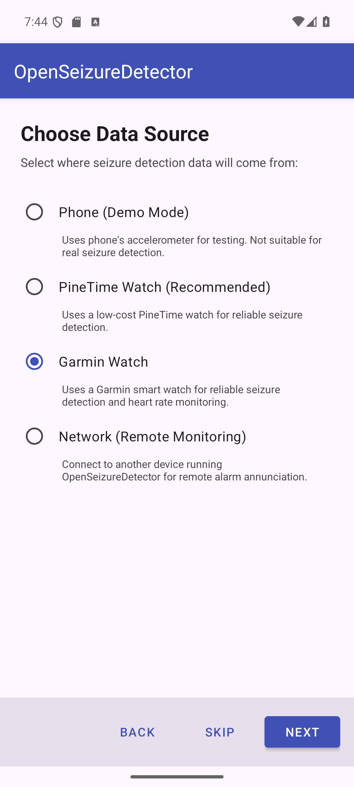
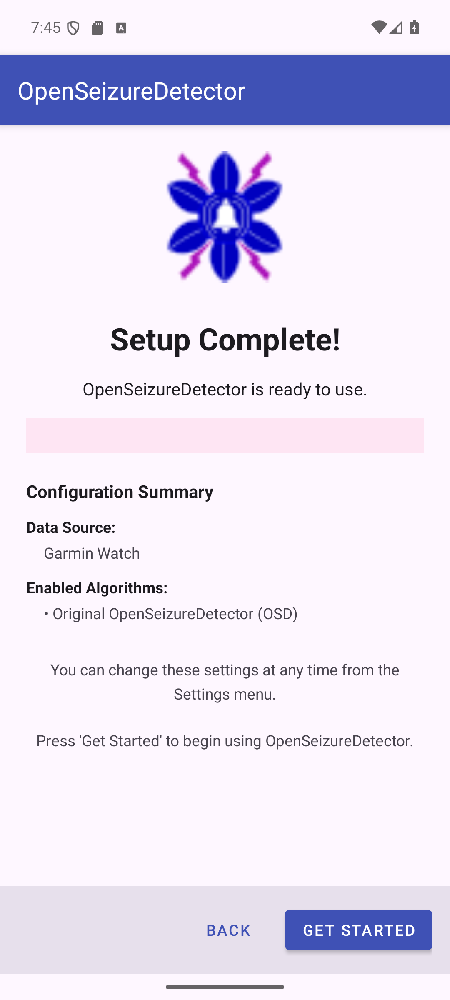

# Setting Up OpenSeizureDetector with a Garmin Watch

This guide walks you through setting up OpenSeizureDetector using a **Garmin** smartwatch.
A Garmin watch provides reliable tonic-clonic seizure detection and, unlike the PineTime,
also delivers accurate continuous heart rate monitoring.

## Before You Start

You will need:
- An Android phone running Android 8.0 or later
- A supported Garmin watch (see https://openseizuredetector.org.uk for the supported device list)
- The **Garmin Connect** app installed on your phone
- Access to a **computer with a USB port** (required for initial watch app installation)

**Important:** The Garmin watch app file must be copied to the watch via a USB connection
from a computer - this step cannot be completed on a phone alone. Refer to the
*Garmin Seizure Detector* page on the OpenSeizureDetector website for the latest detailed
instructions: https://openseizuredetector.org.uk

---

## Step 1 - Welcome Screen

When you first install and launch OpenSeizureDetector, the setup wizard starts automatically.

The wizard guides you through:
- Choosing your data source (the watch)
- Configuring the data source
- Selecting seizure detection algorithms

Press **Next** to continue, or **Skip** to configure manually via Settings later.

---

## Step 2 - Choose Data Source

On the *Choose Data Source* screen, select **Garmin Watch**.

| Option | Description |
|--------|-------------|
| Phone (Demo Mode) | Uses the phone accelerometer - for testing only, not real seizure detection |
| PineTime Watch (Recommended) | Low-cost wrist watch - reliable seizure detection |
| **Garmin Watch** | Garmin smart watch - seizure detection plus heart rate monitoring |
| Network (Remote Monitoring) | Receives alarms from another OSD device on your Wi-Fi |

Press **Next** to continue.

---

## Step 3 - Configure Garmin Watch

The Garmin configuration screen summarises the steps needed to set up your watch.

**Note:** For full details refer to the *Garmin Seizure Detector* page on the
OpenSeizureDetector website: https://openseizuredetector.org.uk

### Step 3-1 - Pair the Watch with Garmin Connect

Pair your Garmin watch with your Android phone using the **Garmin Connect** app, following
Garmin's standard pairing instructions. This establishes the Bluetooth link between the
phone and watch that OpenSeizureDetector uses.

### Step 3-2 - Download the GarminSD Watch App File

On a **computer** (not the phone), download the GarminSD watch app `.prg` file from the
OpenSeizureDetector source code repository on GitHub:
https://github.com/OpenSeizureDetector

The installation of custom Garmin watch apps requires a computer with a USB connection -
it cannot currently be performed directly from the phone.

### Step 3-3 - Connect Your Watch to the Computer via USB

Plug your Garmin watch into the computer using its charging/data USB cable. The watch
will appear as a removable drive.

### Step 3-4 - Copy the Watch App File onto the Watch

Copy the downloaded `.prg` file into the `GARMIN/APPS` folder on the watch drive.
Safely eject the watch when the copy is complete.

### Step 3-5 - Launch the OpenSeizureDetector App on Your Watch

On the Garmin watch, navigate to **Apps** and launch the **OpenSeizureDetector** (GarminSD)
app. The watch app must be running before the phone app can connect.

**Important:** Make sure the Garmin watch app is running before pressing Next.

Press **Next** once the watch app is confirmed running.

---

## Step 4 - Select Detection Algorithms

Choose which seizure detection algorithms to enable. You can select **more than one**.

| Algorithm | Description |
|-----------|-------------|
| **ML Algorithm (Recommended)** | Machine Learning / AI detection. Good sensitivity, fewer false alarms. Improves over time via community data sharing. |
| **Heart Rate Alerts** | Detects abnormal heart rate patterns. Garmin provides reliable continuous HR - highly recommended with a Garmin watch. |
| **OSD Algorithm** | Original proven algorithm. Good for overnight use; may false-alarm on repetitive movements (brushing teeth, washing dishes etc.). |
| OSD with Flap Detection | Enhanced OSD that also detects arm flapping for maximum night-time tonic-clonic detection. |

**At least one algorithm must be selected** before Next is enabled.

**Recommended choice for Garmin:**
- ML Algorithm - best balance of sensitivity and false-alarm rate
- Heart Rate Alerts - key advantage of a Garmin; uses the watch built-in HR sensor
- OSD Algorithm - proven reliable backup, especially overnight

### Algorithm configuration dialogs

After pressing Next, a short confirmation dialog appears for each enabled algorithm:

- **OSD Algorithm** - default settings applied. Tap **OK**.
- **OSD with Flap Detection** - default settings applied. Tap **OK**.
- **ML Algorithm** - the recommended ML model is downloaded automatically. If unavailable,
  ML is gracefully disabled and can be re-enabled from Settings once a model is available.
- **Heart Rate Alerts** - default HR thresholds are applied. Tap **OK**.
  You can fine-tune these thresholds in Settings after the wizard completes.

---

## Step 5 - Setup Complete

The final screen confirms your configuration.

The summary shows:
- **Data Source** - Garmin Watch
- **Enabled Algorithms** - the algorithms that will run

Press **Get Started** to launch the main monitoring screen.

---

## What Happens Next

1. OpenSeizureDetector starts its background monitoring service
2. The Garmin watch app must be running on the watch for the phone to receive data
3. Wrist movement and heart rate data stream continuously to the phone
4. If a seizure pattern or abnormal heart rate is detected, the app raises an alarm and
   (if configured) sends notifications to your carers

All settings can be changed at any time from the **Settings** menu - you do not need to
re-run the wizard.

---

## Heart Rate Alert Configuration

Because Garmin provides reliable heart rate data, review the default HR alert thresholds
in Settings after setup:

| Setting | Default | Description |
|---------|---------|-------------|
| Max Heart Rate | 120 bpm | Alert if HR exceeds this value |
| Min Heart Rate | 40 bpm | Alert if HR drops below this value |

Adjust these to suit the person being monitored, based on advice from their medical team.

---

## Troubleshooting

| Problem | Solution |
|---------|----------|
| Watch app not found on USB drive | Navigate to the GARMIN/APPS folder; create it if it does not exist |
| Phone not receiving data from watch | Ensure the GarminSD app is actively running on the watch, not just installed |
| App shows Connecting indefinitely | Re-launch the GarminSD app on the watch and restart OSD on the phone |
| Heart rate not displayed | Wear the watch snugly; ensure the HR sensor window on the watch back is clean |
| Garmin Connect pairing fails | Follow Garmin official pairing instructions for your specific watch model |

For full Garmin setup instructions see: https://openseizuredetector.org.uk
