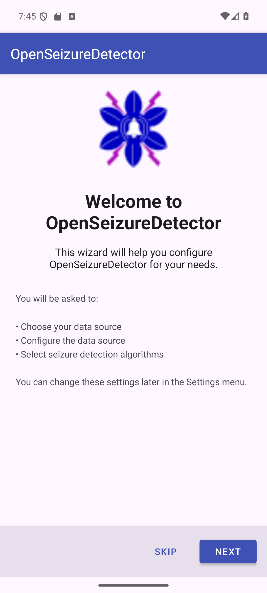
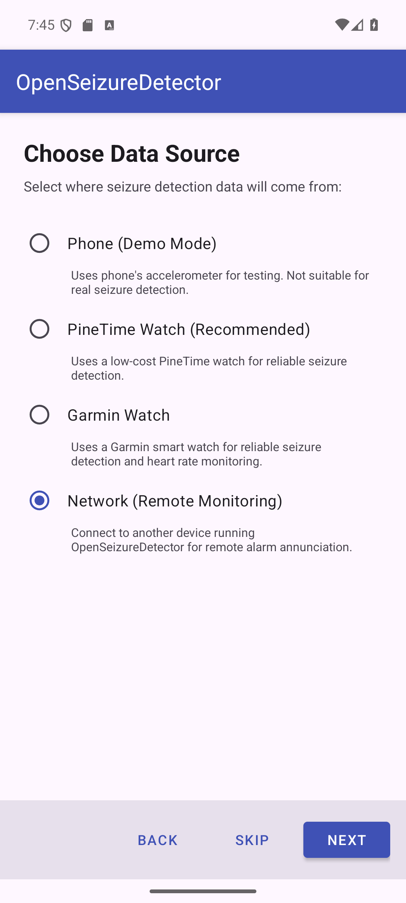
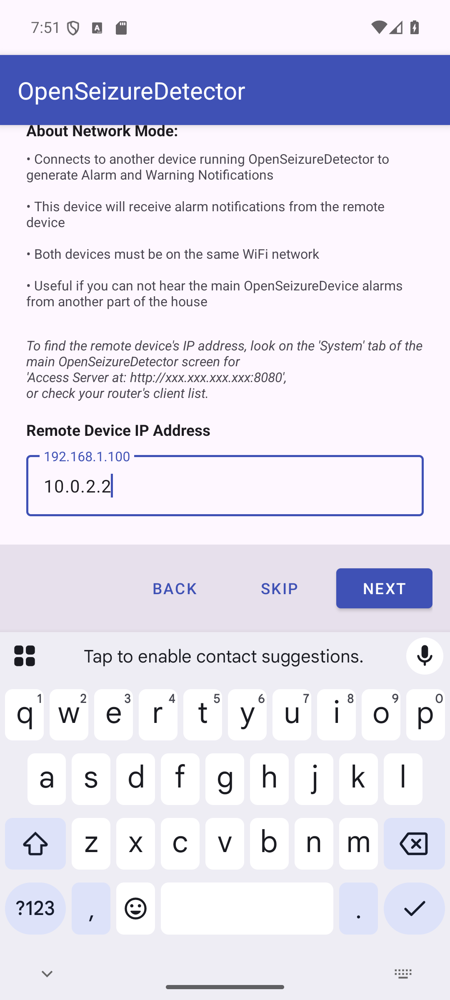
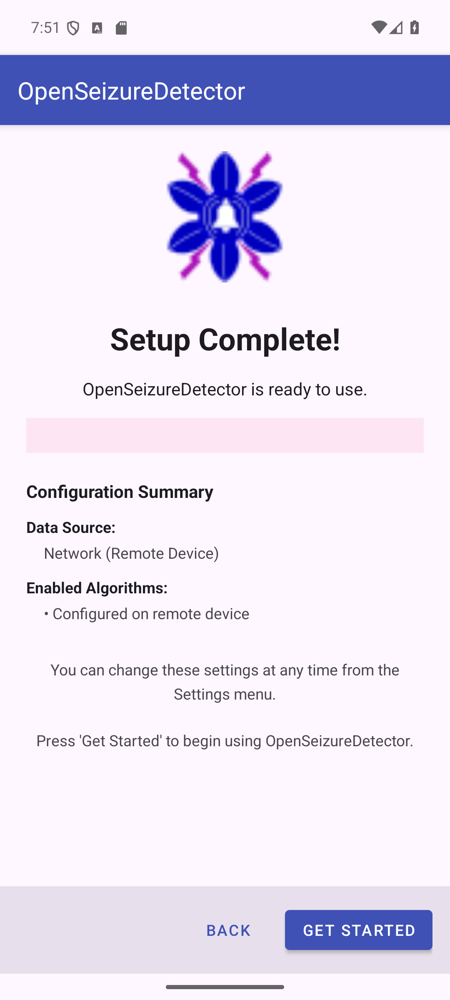

# Setting Up OpenSeizureDetector as a Remote Alarm Receiver (Network Mode)

This guide explains how to set up a second Android phone (or tablet) as a **remote alarm
receiver** for an existing OpenSeizureDetector installation. This is useful when the person
being monitored is in a different room and you need alarm notifications on a second device,
for example a phone carried by a carer overnight.

## How Network Mode Works

```
[PineTime / Garmin watch]
         |
         | Bluetooth
         v
[Primary phone running OSD]  <-- detects seizures, raises alarms
         |
         | Wi-Fi (same local network)
         v
[This phone in Network mode] <-- receives alarm notifications remotely
```

Both devices must be on the **same Wi-Fi network**.

## Before You Start

You will need:
- A **second** Android phone or tablet running Android 8.0 or later
- An **existing** OpenSeizureDetector installation on a primary device (with a watch connected)
- Both devices on the same Wi-Fi network
- The IP address of the primary device (see below)

### Finding the Primary Device IP Address

On the primary phone, open OpenSeizureDetector and look at the **System** tab. You will see
a line like:

    Access Server at: http://192.168.1.50:8080

The four numbers separated by dots (e.g. `192.168.1.50`) are the IP address you need.
Alternatively, find the IP address in your router's connected devices list.

---

## Step 1 - Welcome Screen

Install OpenSeizureDetector on the second device. When you first launch it, the setup
wizard starts automatically.



Press **Next** to continue.

---

## Step 2 - Choose Data Source

On the *Choose Data Source* screen, select **Network (Remote Monitoring)**.



| Option | Description |
|--------|-------------|
| Phone (Demo Mode) | Uses the phone accelerometer - for testing only |
| PineTime Watch (Recommended) | PineTime wrist watch seizure detection |
| Garmin Watch | Garmin smart watch seizure detection |
| **Network (Remote Monitoring)** | Receives alarms from another OSD device on your Wi-Fi |

Press **Next** to continue.

---

## Step 3 - Configure Network Connection

The network configuration screen asks for the IP address of the primary device.

### Empty state (before entering IP)


The screen explains:
- This device will receive alarm notifications from the remote (primary) device
- Both devices must be on the same Wi-Fi network
- No seizure detection algorithms run on this device - those run on the primary device

### Entering the IP address

Tap the IP address field and type the IP address of the primary device.



As you type a valid IP address (four numbers separated by dots, e.g. `192.168.1.50`),
the app automatically attempts to connect to the primary device on port 8080.

**Validation results:**

| Status | Meaning |
|--------|---------|
| Green: *Server validated successfully* | Connected - tap Next to continue |
| Orange: *Cannot reach server* | Check IP address and that both devices are on the same Wi-Fi |
| Red: *Invalid IP address format* | The address format is wrong - check you have typed it correctly |

A **Retry** button appears if validation fails - tap it after checking your settings.

**Note:** The **Next** button only becomes enabled once the primary device is successfully
reached. Algorithm selection is skipped entirely in Network mode - the algorithms are
configured on the primary device.

Press **Next** once validation succeeds (shown in green).

---

## Step 4 - Setup Complete

The wizard skips the algorithm selection step (since algorithms run on the primary device)
and goes straight to the completion screen.



The summary shows:
- **Data Source** - Network (Remote Device)
- **Enabled Algorithms** - Configured on remote device

Press **Get Started** to launch the monitoring screen.

---

## What Happens Next

1. OpenSeizureDetector connects to the primary device over Wi-Fi
2. The primary device sends alarm status updates every 2 seconds
3. When the primary device raises a Warning or Alarm, this device:
   - Sounds the alarm tone
   - Displays a notification
   - Shows the alarm status on screen

The second device mirrors the alarm state of the primary device in near real-time.

---

## Important Notes

- The **primary device** must have OpenSeizureDetector running and connected to the watch
  at all times for remote monitoring to work
- If the Wi-Fi connection is lost, the secondary device will show a connection error
- The secondary device does **not** need a watch connected
- Alarm sensitivity and algorithm settings are controlled only on the primary device
- All settings can be changed at any time from the **Settings** menu

---

## Troubleshooting

| Problem | Solution |
|---------|----------|
| Cannot reach server | Confirm both phones are on the same Wi-Fi network (not mobile data) |
| IP address keeps changing | Set a static IP (DHCP reservation) for the primary phone in your router settings |
| Alarm notifications not appearing | Check Android notification permissions for OpenSeizureDetector on this device |
| Validation succeeds but no alarms received | Ensure OSD is running and connected to the watch on the primary device |
| Connection drops overnight | Disable Wi-Fi sleep/power-saving on both devices |

For more information visit https://openseizuredetector.org.uk
