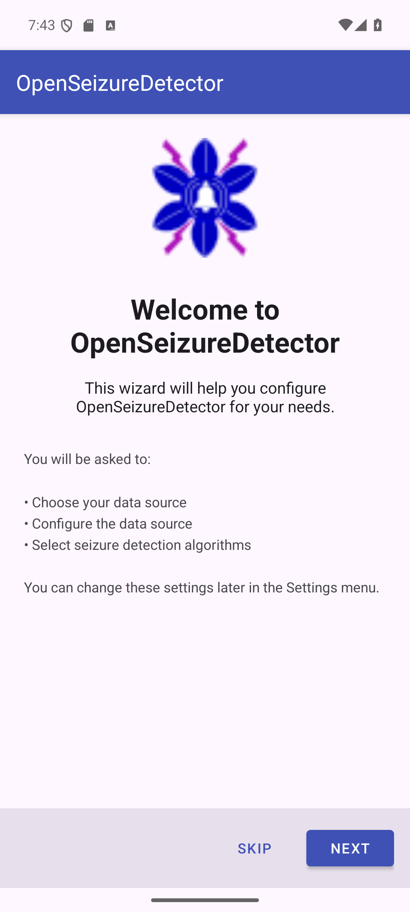
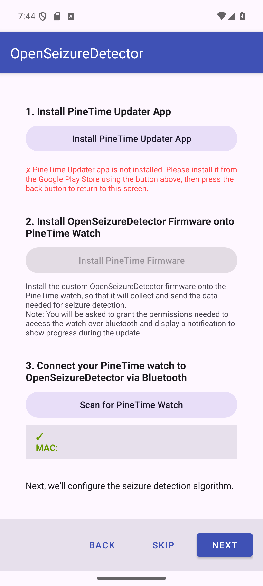
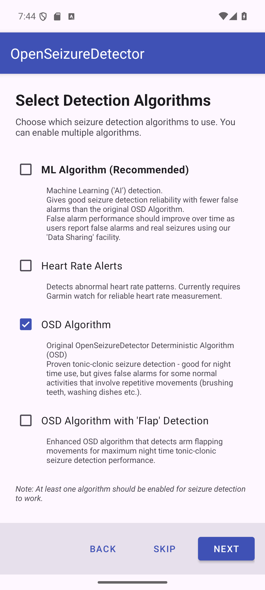
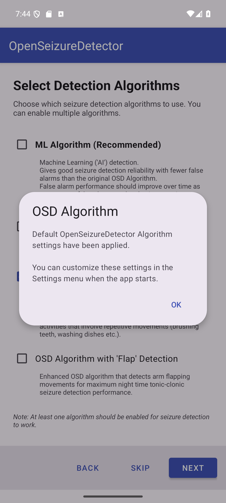
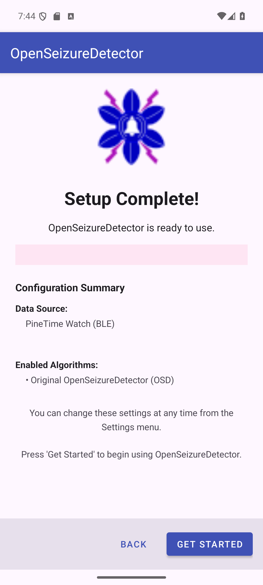

# Setting Up OpenSeizureDetector with a PineTime Watch

This guide walks you through setting up OpenSeizureDetector using a **PineTime** smartwatch
as the motion sensor. The PineTime is a low-cost, open-source wrist watch specifically
supported for reliable tonic-clonic seizure detection.

## Before You Start

You will need:
- An Android phone running Android 8.0 or later
- A PineTime watch (available from [Pine64](https://www.pine64.org/pinetime/))
- Bluetooth enabled on your phone

---

## Step 1 - Welcome Screen

When you first install and launch OpenSeizureDetector, the setup wizard starts automatically.

The wizard guides you through:
- Choosing your data source (the watch)
- Configuring the data source (pairing)
- Selecting seizure detection algorithms

Press **Next** to continue, or **Skip** to configure manually via Settings later.

---

## Step 2 - Choose Data Source

On the *Choose Data Source* screen, select **PineTime Watch (Recommended)**.

| Option | Description |
|--------|-------------|
| Phone (Demo Mode) | Uses the phone accelerometer - for testing only, not real seizure detection |
| **PineTime Watch (Recommended)** | Low-cost wrist watch - reliable seizure detection |
| Garmin Watch | Garmin smart watch - also supports heart rate monitoring |
| Network (Remote Monitoring) | Receives alarms from another OSD device on your Wi-Fi |

Press **Next** to continue.

---

## Step 3 - Configure PineTime Watch

The PineTime configuration screen guides you through three sub-steps.

### 3a - Install the PineTime Updater App

The **PineTime Updater** companion app is needed to flash the OpenSeizureDetector firmware
onto your watch.

- If the updater is **not installed**: an **Install PineTime Updater App** button appears.
  Tap it to open Google Play, install the app, then press Back to return here.
- If it is **already installed**: you will see a green tick:
  *PineTime Updater app is installed*.

### 3b - Install OpenSeizureDetector Firmware onto the Watch

Tap **Install PineTime Firmware** to launch the PineTime Updater app.

**Note:** The updater will request Bluetooth permissions and a notification permission.
Please grant both so the firmware transfer can complete.

The updater scans for nearby PineTime watches, transfers the custom OpenSeizureDetector
firmware, then returns you to this screen automatically. The watch Bluetooth address is
recorded automatically - no manual entry needed.

### 3c - Connect (Scan) for the Watch

Tap **Scan for PineTime Watch** to search for your watch over Bluetooth. A list of nearby
Bluetooth devices appears - select your PineTime.

Once selected, the screen shows the device name and MAC address in green, for example:

    PineTime   MAC: AB:CD:EF:12:34:56

If *No device selected* is shown in orange, go back and scan again.

Press **Next** when your watch appears in green.

---

## Step 4 - Select Detection Algorithms

Choose which seizure detection algorithms to enable. You can select **more than one**.

| Algorithm | Description |
|-----------|-------------|
| **ML Algorithm (Recommended)** | Machine Learning / AI detection. Good sensitivity with fewer false alarms. Improves over time via community data sharing. |
| Heart Rate Alerts | Detects abnormal heart rate. Currently requires a Garmin watch for reliable HR measurement. |
| **OSD Algorithm** | Original proven algorithm. Good for overnight use; may false-alarm on repetitive movements (brushing teeth, washing dishes etc.). |
| OSD with Flap Detection | Enhanced OSD that also detects arm flapping for maximum night-time tonic-clonic detection. |

**At least one algorithm must be selected** before Next is enabled.

**Recommended choice for PineTime:**
- ML Algorithm - best balance of sensitivity and false-alarm rate
- OSD Algorithm - proven reliable backup, especially overnight

### Algorithm configuration dialogs

After pressing Next, a short confirmation dialog appears for each enabled algorithm:

- **OSD Algorithm** - default settings applied automatically. Tap **OK**.
- **OSD with Flap Detection** - default settings applied. Tap **OK**.
- **ML Algorithm** - the recommended ML model is downloaded automatically. If no model is
  available, ML is gracefully disabled and can be re-enabled from Settings later.
- **Heart Rate Alerts** - default HR thresholds applied. Tap **OK**.

---

## Step 5 - Setup Complete

The final screen confirms your configuration.

The summary shows:
- **Data Source** - your PineTime name and Bluetooth MAC address
- **Enabled Algorithms** - the algorithms that will run

Press **Get Started** to launch the main monitoring screen.

---

## What Happens Next

1. OpenSeizureDetector starts its background monitoring service
2. The app connects to your PineTime over Bluetooth
3. Wrist movement data streams continuously to the phone
4. If a seizure pattern is detected, the app raises an alarm and (if configured) sends
   notifications to your carers

All settings can be changed at any time from the **Settings** menu - you do not need to
re-run the wizard.

---

## Troubleshooting

| Problem | Solution |
|---------|----------|
| Watch not found during scan | Ensure watch is charged, on wrist, and phone Bluetooth is enabled |
| Firmware update fails | Keep watch within 1 metre of phone during the update |
| App not connecting after setup | Force-stop the app and restart; or re-scan via Settings - Bluetooth |
| PineTime Updater not on Play Store | Check your regional store or see the OpenSeizureDetector GitHub releases page |

For more information visit https://openseizuredetector.org.uk
